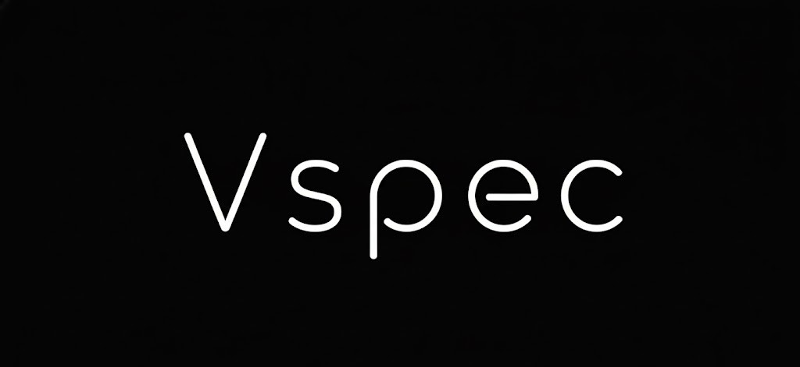

<p align="center">
  
</p>

<p align="center">
  <small><b>Vspec Engine</b> — kernel-first runtime for native ultra-low-bit (2/3/4-bit) LLM & diffusion inference, with IR-driven execution and memory-aware scheduling.</small>
</p>

<p align="center">
  
  
  
  
  
  
  
  
  
  
</p>
# 🚀 Vspec Engine

Vspec Engine is a kernel-first runtime for low-bit LLM and diffusion inference.  
It is designed for native under-4-bit execution, modular backend abstraction, and memory-aware scheduling.

Vspec evolves core ideas from PyLittle into a standalone runtime layer — not a framework wrapper, not a server engine, but a redefinable inference core.

## 🎯 Why Vspec?

Existing inference engines often:

- Depend on framework runtimes (e.g., PyTorch)
- Focus on specific hardware stacks
- Optimize scheduling but not kernel abstraction
- Treat quantization as an afterthought

Vspec takes a different path:

- 🔬 Kernel-first architecture
- 🧩 IR-driven execution
- 🧠 Memory-aware scheduling
- ⚡ Native mixed 2/3/4-bit packed execution
- 🌍 Vendor-neutral backend abstraction (CUDA / ROCm / SYCL planned)

The goal is not to wrap models —  
but to redefine the inference runtime layer itself.

## 🧠 Architecture Overview

Vspec consists of the following layers:

### 1️⃣ IR Layer
Compact graph representation optimized for low-bit execution.

### 2️⃣ Scheduler
Memory-first execution planner with:

- KV cache awareness
- Arena/pool allocation
- Streaming attention support
- Graph rewrite capability

### 3️⃣ Kernel Registry
Backend-specific kernel implementations:

- CPU reference path
- CUDA optimized kernels
- Future ROCm / SYCL support

### 4️⃣ Allocator
Custom memory management:

- Arena allocator
- Pool allocator
- Quantized weight packing

### 5️⃣ Python Bridge
C API boundary enabling:

- PyTorch model conversion → Vspec IR
- Python-driven benchmarking
- Integration experiments
- No torch runtime dependency

## ⚙️ Core Capabilities

- ✅ Native mixed-bit (2/3/4-bit packed)
- ✅ Runtime IR-centric design
- ✅ Multi-backend abstraction (CUDA + planned ROCm + SYCL)
- ✅ KV-aware memory system
- ✅ Python API independent of PyTorch runtime
- ✅ Dynamic scheduling & graph rewrite
- ✅ Kernel-level extensibility

## 📌 Project Status

Current stage: Research / Experimental runtime

- CPU reference path is stable.
- CUDA backend is functional for core kernels.
- ROCm and SYCL backends are planned.
- IR and ABI may evolve.
- Not production-hardened yet.

This is a runtime architecture project, not a packaged inference product.

## 🛠 Requirements

- CMake 3.20+
- MSVC (Windows) or clang/gcc (Linux/macOS)
- CUDA toolkit (optional, for CUDA targets)
- Python 3.9+ (optional, for bridge & tools)

## 🏗 Build

### 🪟 Windows
```sh
cmake -S . -B build
cmake --build build --config Release
```

### 🔍 CUDA Detection

CUDA detection is automatic if installed.

If needed, specify CUDA manually:

```bat
cmake -S . -B build ^
  -DCMAKE_CUDA_COMPILER="C:\Program Files\NVIDIA GPU Computing Toolkit\CUDA\v12.8\bin\nvcc.exe" ^
  -DCUDAToolkit_ROOT="C:\Program Files\NVIDIA GPU Computing Toolkit\CUDA\v12.8" ^
  -DCMAKE_VS_GLOBALS="CudaToolkitDir=C:\Program Files\NVIDIA GPU Computing Toolkit\CUDA\v12.8"
```

### 🐧 Linux / 🍎 macOS
```sh
cmake -S . -B build
cmake --build build -j
```

If CUDA is not detected, CPU reference kernels are used automatically.

## 🧪 Examples & Demos

### Core Demos
- `vspec_int4_demo`
- `vspec_attention_v2_demo`
- `vspec_benchmark`

### Advanced / Internal
- `vspec_stress_test`
- `vspec_cuda_fused_demo` (CUDA only)
- `vspec_phase3_demo`

## 📊 Benchmarking & Comparison

Vspec includes a custom benchmark report builder.

It supports:

- 📦 Memory estimate (baseline vs quantized + KV cache)
- 🚀 Throughput comparison (tokens/sec)
- 📉 Speedup calculation
- 📈 Extra metrics:
  - Perplexity drift
  - SM occupancy
  - Memory bandwidth
  - Warp stall reason
  - Sequence scaling

### 🔄 Workflow

Run baseline inference (FP16/FP32 or llama.cpp) → save log  
Run Vspec inference → save log

Generate report:
Using model Qwen3-8b for testing:
```sh
python tools/benchmark/custom_bench.py \
  --model-id Qwen/Qwen3-8B \
  --ir qwen3_8b_ir_full.json \
  --baseline-precision fp16 \
  --vspec-bits 4 \
  --kv-tokens 2048 \
  --kv-heads 64 \
  --kv-head-dim 128 \
  --output tools/benchmark/qwen3_report.json
```

## 🔄 Model Converter (CLI)

Convert manifest or safetensors header to Vspec IR:

```sh
python tools/converter/vspec_converter.py \
  --input sample_weights.vpt \
  --output out_ir.json
```

## 🐍 Python Bridge (Optional)

Build shared C API:

```sh
./build/Release/vspec_engine_capi.dll
```

Run demo:

```sh
PYTHONPATH=vspec-python/src python examples/python_torch_like_demo.py
```

Python source lives in:

- `./vspec-python`

## 📂 Documentation

- `docs/OPTIMIZATION.md`
- `docs/ABI.md`


## 🌱 Vision

Vspec aims to become a:

- Cross-vendor inference runtime layer
- Native ultra-low-bit execution engine
- Research-grade kernel playground
- Foundation for future inference systems

It is not a wrapper around existing runtimes.  
It is a runtime.

## 🧩 License

Apache 2.0